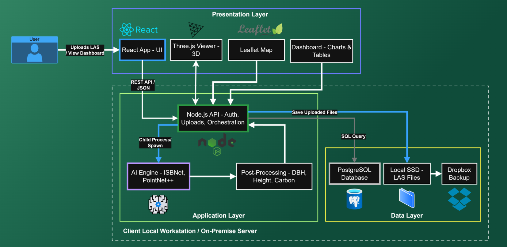
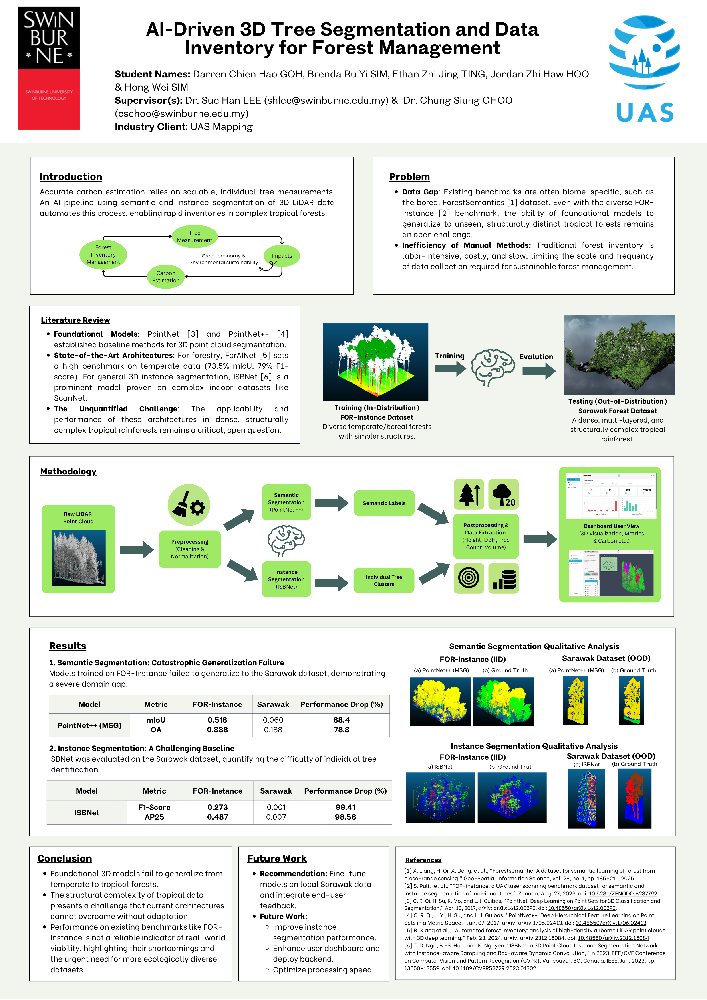

# AI-Driven 3D Tree Organ Segmentation and Data Inventory for Forest Management 🌲☁️

[](https://github.com/dchgoh/FYP-A)
[](https://github.com/dchgoh/FYP-A)

An automated end-to-end AI pipeline that transforms raw LiDAR data (LAS/LAZ) into actionable forest carbon metrics. This project specifically addresses the **"Tropical Gap"**—the failure of state-of-the-art models trained on temperate forests to generalize to complex tropical rainforests like those in Sarawak.

---

## 📑 Research Context
Standard 3D segmentation models (PointNet++, ISBNet) are typically trained on temperate/boreal benchmarks (e.g., FOR-Instance). This project scientifically quantifies the **Domain Gap**, revealing an **80%+ performance drop** when applying these models to tropical datasets. Our solution provides a manually refined annotation workflow to bridge this gap.

---

<!-- RESEARCH PAPER SECTION -->
### 📚 Publications
Our research on the domain gap and tropical forest generalization was presented at the **APSIPA ASC 2025** conference:

**"Canopy to Canopy: Evaluating Model Generalization In 3D Tropical Forest Semantic Segmentation"**  
*Brenda Ru Yi SIM, Lee Sue Han, Choo Chung Siung, and Yuen Peng Loh.*  
[📄 Read the full paper here](https://doi.org/10.1109/APSIPAASC65261.2025.11249085)

---

## 🏗️ System Architecture
  

*The system utilizes a React/Three.js frontend, a Node.js orchestration layer, and a PyTorch-based AI engine to process heavy LAS/LAZ files locally with enterprise-grade security.*

---

## 🚀 Key Features
### 1. Automated AI Pipeline
*   **Seamless Ingestion:** Upload `.las` or `.laz` files.
*   **Semantic Segmentation:** Fine-grained structural classification into 5 classes (Stem, Terrain, Live Branches, Woody Branches, Low Vegetation) using **PointNet++**.
*   **Instance Segmentation:** Individual tree clustering and ID assignment via **ISBNet**.

### 2. Interactive 3D Digital Twin
*   **Three.js Viewer:** Efficient web-based rendering of segmented point clouds.
*   **Filtering & Toggling:** Instantly isolate specific tree organs or individual Tree IDs.
*   **Manual Annotation:** A "Lasso" tool to manually refine AI results for high-precision inventory requirements.

### 3. Automated Metric Extraction
*   **Tree Metrics:** Automated calculation of Height ($Z_{max} - Z_{min}$) and DBH (Circle fitting at 1.3m).
*   **Carbon Valuation:** Biomass and Carbon sequestration estimation based on IPCC standards and allometric equations.
*   **Data Export:** One-click export to Excel for official forestry reporting.

### 4. Management & Security Suite
*   **Hierarchical Organization:** Manage data at scale using a structured hierarchy: **Division → Project → Plot**.
*   **Advanced Filtering:** Robust search system to find specific datasets or inventory records across massive files.
*   **Role-Based Access Control (RBAC):** 
    *   **Administrator:** Global control and user management.
    *   **Data Manager:** Upload and process data; edit metadata.
    *   **Regular User:** Read-only access to 3D dashboards and reports.

---

## 🛠️ Tech Stack
| Layer | Technologies |
| :--- | :--- |
| **Frontend** | ReactJS, Three.js, Leaflet, Tailwind CSS |
| **Backend** | Node.js (Express), Redis (Upload Optimization) |
| **AI Engine** | Python, PyTorch, PointNet++, ISBNet |
| **Database** | PostgreSQL |
| **DevOps** | Docker, AWS (Initial), On-Premises (Final Deployment) |

---

## 📊 Performance Analysis
Our testing identified a significant generalization failure when moving from European (FOR-Instance) to Tropical (Sarawak) datasets:

| Model | Metric | Temperate (IID) | Tropical (OOD) | Performance Drop |
| :--- | :--- | :--- | :--- | :--- |
| **PointNet++** | mIoU | 0.518 | 0.060 | **88.4%** |
| **ISBNet** | F1-Score | 0.273 | 0.001 | **99.4%** |

---

## ⚙️ Getting Started

### Prerequisites
Before you begin, ensure you have the following installed:
*   **Node.js and npm:** (e.g., v18.x or later for Node, npm usually comes with it)
    *   [Download Node.js](https://nodejs.org/)
*   **Git:** For cloning the repository.
    *   [Download Git](https://git-scm.com/)
*   **Docker Desktop:** Required for running dependent services, particularly the AI backend which handles file conversion and segmentation.
    *   [Download Docker Desktop](https://www.docker.com/products/docker-desktop/)

### Installation
1. **Clone this Repository:**
   ```bash
   git clone git@github.com:dchgoh/FYP-A.git
   cd FYP-A
   ```

2. **Install Project Dependencies:**
   Install all the necessary Node.js packages for this application.
   ```bash
   npm install
   ```

4. **Start Docker:**
   Open Docker Desktop and ensure it is running.

5. **Run the Application:**
   Start the React development server.
   ```bash
   npm start
   ```
   This will typically open the application in your default web browser at `http://localhost:3000`

6. **Run test.las File:**
*   Go to the Upload section within the app interface.
*   Select and upload input (e.g. test.las) file.
*   The system will automatically begin processing the file.

---

## 🖼️ Project Poster
<!-- You can use a smaller preview of the poster here -->
<details>
  <summary><b>Click to view our poster</b></summary>
  <br>
  
</details>

---

## Acknowledgements
This project acknowledges the foundational work and resources that made it possible:

*   **Dataset:** We utilized the **`for-instance` dataset** for training, testing and demonstrating point cloud processing. We thank **Stefano Puliti** and co-authors for making this valuable resource available:
    ```
    Puliti, S, Pearse, G, Surový, P, Wallace, L, Hollaus, M, Wielgosz, M & Astrup, R 2023, FOR-instance: a UAV laser scanning benchmark dataset for semantic and instance segmentation of individual trees, Zenodo, viewed 30 April 2025, <https://zenodo.org/record/8287792>.
    ```

*   **Deep Learning Architectures:** Our AI segmentation is based on the pioneering work on deep learning for point clouds by **Charles R. Qi** and his colleagues. We acknowledge and reference the following key publications:
    ```
    Qi, CR, Su, H, Mo, K & Guibas, LJ 2017, PointNet: Deep Learning on Point Sets for 3D Classification and Segmentation, arXiv, viewed 30 April 2025, <http://arxiv.org/abs/1612.00593>.
    ```
    ```
    Qi, CR, Yi, L, Su, H & Guibas, LJ 2017, PointNet++: Deep Hierarchical Feature Learning on Point Sets in a Metric Space, arXiv, viewed 30 April 2025, <http://arxiv.org/abs/1706.02413>.
    ```

---

*Developed for the Final Year Project at Swinburne University of Technology.*
